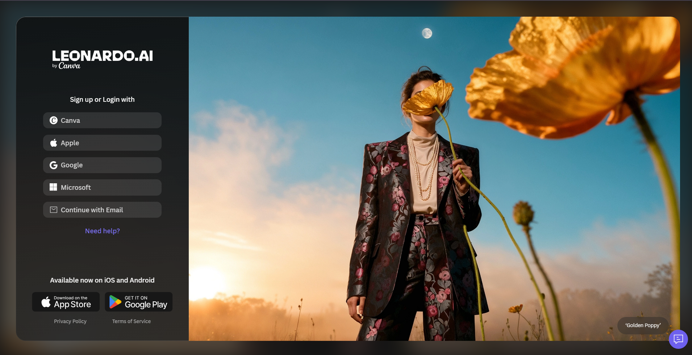
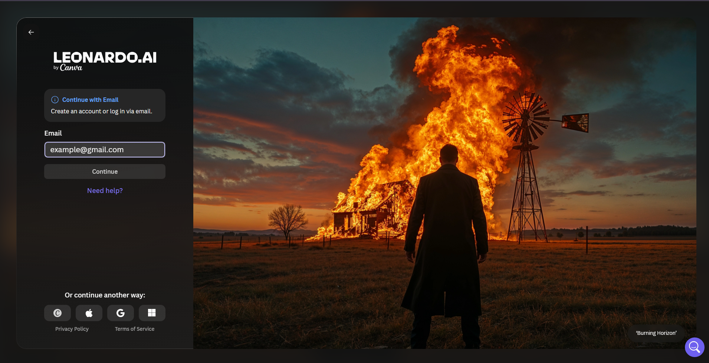
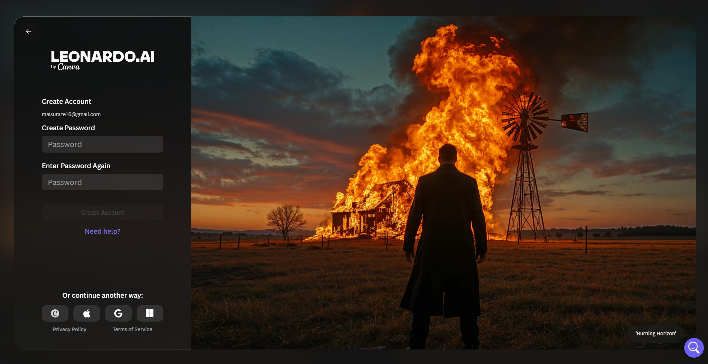
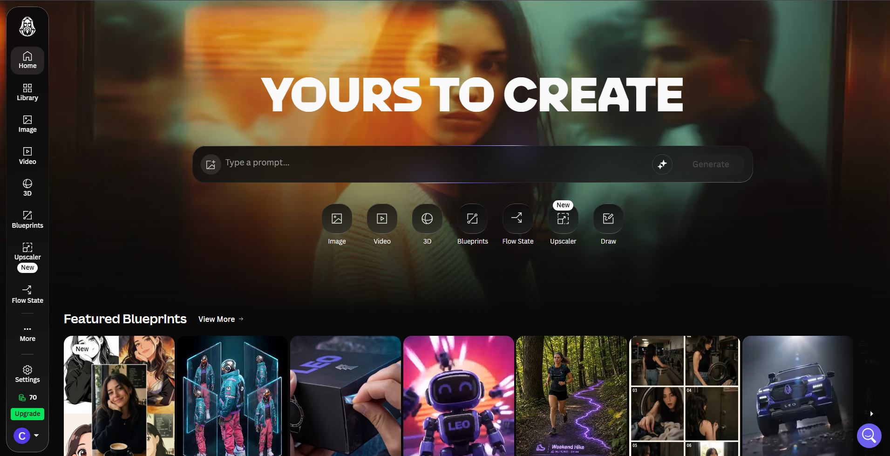
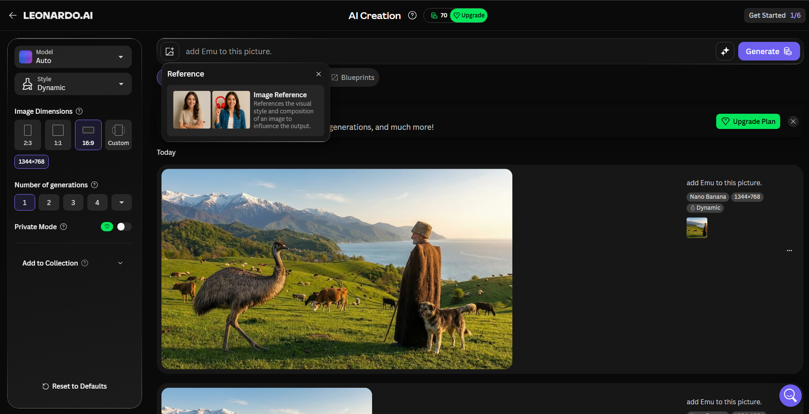
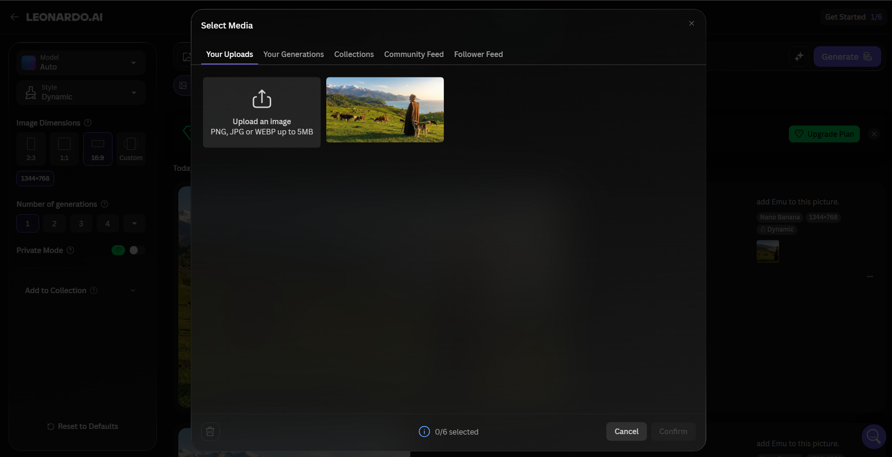
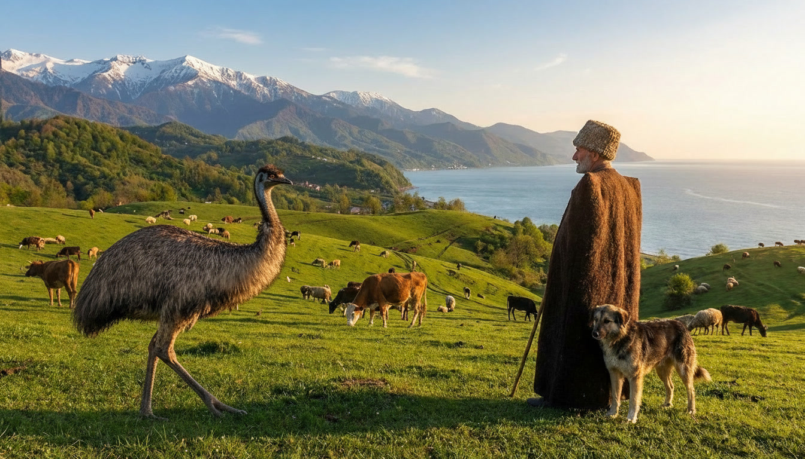

# AI-Final

# User Manual: Sign Up for Leonardo.AI and Add an Emu to a Picture

## Purpose

This manual explains how to:

1. Sign up for Leonardo.AI at `app.leonardo.ai`.
2. Open the AI image creation interface.
3. Upload or select the starting picture.
4. Use a prompt to add an Emu to the picture.
5. Review the final generated image.

## Requirements

Before starting, make sure you have:

- A stable internet connection.
- An email address, Canva, Apple, Google, or Microsoft account.
- The starting picture you want to edit.
- Access to Leonardo.AI through `app.leonardo.ai`.

---

## Part 1: Sign Up for Leonardo.AI

### Step 1: Open Leonardo.AI

1. Open your web browser.
2. Go to `https://app.leonardo.ai`.
3. The sign-up and login screen will appear.



### Step 2: Choose a Sign-Up Method

On the sign-up screen, choose one of the available options:

- Canva
- Apple
- Google
- Microsoft
- Continue with Email

For this manual, the email method is used.

### Step 3: Continue with Email

1. Click **Continue with Email**.
2. Enter your email address in the email field.
3. Click **Continue**.



### Step 4: Create a Password

1. Enter a password in the **Create Password** field.
2. Enter the same password again in the **Enter Password Again** field.
3. Click **Create Account**.



### Step 5: Complete Any Account Checks

If Leonardo.AI asks you to verify your email or complete another security step, follow the instructions on the screen. After the account is ready, you will be taken into the Leonardo.AI workspace.

---

## Part 2: Open the AI Image Creation Interface

### Step 6: Go to the Home Screen

After signing in, the Leonardo.AI home screen appears. This page includes a prompt box and several creation tools.



### Step 7: Open Image Creation

1. Click the **Image** option from the main creation tools.
2. The AI image creation interface will open.
3. This is where you can enter a prompt, upload reference media, choose image dimensions, and generate the result.

---

## Part 3: Add an Emu to the Picture

### Step 8: Enter the Prompt

1. Click inside the prompt box.
2. Type the prompt:

```text
add Emu to this picture.
```

3. Check that the prompt is clear and simple.

### Step 9: Open the Image Reference Upload Area

1. Click the image/reference icon next to the prompt field.
2. A reference panel will appear.
3. Choose **Image Reference** to use an existing picture as the starting point.



### Step 10: Select the Starting Picture

1. In the media selection window, click **Upload an image** if your picture is not already uploaded.
2. Select the starting picture from your computer.
3. If the image is already uploaded, click its thumbnail.
4. Confirm the selection.

The uploaded starting picture is shown in the media selection window.



### Step 11: Set Image Options

Before generating, review the settings on the left side of the interface:

- **Model:** Auto
- **Style:** Dynamic
- **Image Dimensions:** 16:9
- **Number of generations:** 1

These settings are suitable for a wide landscape image.

### Step 12: Generate the Edited Image

1. Make sure the prompt says:

```text
add Emu to this picture.
```

2. Make sure the reference image is attached.
3. Click **Generate**.
4. Wait for Leonardo.AI to create the edited image.

---

## Part 4: Review the Result

### Step 13: Check the Generated Image

After generation finishes, review the output. The final image should show the original landscape scene with an Emu added naturally into the picture.



### Step 14: Save or Download the Result

If you are happy with the result:

1. Open the generated image.
2. Use the download or save option in Leonardo.AI.
3. Save the final picture to your computer.

If the Emu does not look correct, edit the prompt and generate again. For example:

```text
Add a realistic Emu standing on the grass in the left side of the picture.
```

# Task 3 answer: Graph Navigator Bot — Full Graph
 
The chatbot's graph definition was embedded (XOR + Base64 encoded) inside the page's
`<script>` block. Decoding it reveals the following graph:
 
- **START node:** WRAIT
- **GOAL node:** GLINT
- **10 nodes**, **15 edges** (some directed `->`, some bidirectional `--` / `<>`)
## Decoded graph source
 
```
START WRAIT
GOAL GLINT
 
NODE WRAIT, TITAN, NEXA, DELTA, LUMA, GIVA, JOLT, ZORI, VISTA, GLINT
 
EDGE WRAIT -> TITAN (1)
EDGE WRAIT -> NEXA  (1)
EDGE TITAN -- DELTA (1)   [bidirectional]
EDGE TITAN -> LUMA  (1)
EDGE NEXA  <> LUMA  (1)   [bidirectional]
EDGE NEXA  -> GIVA  (1)
EDGE DELTA -> JOLT  (2)
EDGE LUMA  -> ZORI  (1)
EDGE GIVA  <> ZORI  (1)   [bidirectional]
EDGE GIVA  -> VISTA (1)
EDGE JOLT  -> GLINT (3)
EDGE ZORI  -> GLINT (1)
EDGE VISTA -- GLINT (1)   [bidirectional]
EDGE ZORI  <> VISTA (1)   [bidirectional]
EDGE TITAN <> NEXA  (1)   [bidirectional]
```
 
All 10 nodes are reachable from START (WRAIT), and GLINT (GOAL) is reachable via three
different paths: WRAIT→TITAN→DELTA→JOLT→GLINT, WRAIT→...→LUMA→ZORI→GLINT, and
...→GIVA→VISTA→GLINT.
 
## Full graph diagram
 
Double-headed arrows = bidirectional edges (`--` or `<>`). Single-headed arrows =
one-way edges (`->`). Numbers on edges are the transition weights.
 

